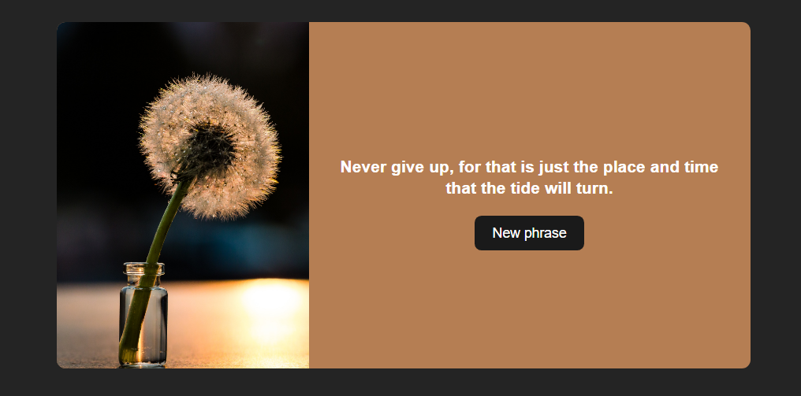

<p align="center">
    
</p>

<br />

---
## Description

A simple application that fetches phrases from an API and display it on screen.

---

## Technologies

- [React](https://reactjs.org)
- [Styled Components](https://styled-components.com)
- [Redux](https://redux.js.org)
- [Redux Saga](https://redux-saga.js.org)

---

## Running the Project Locally
- Clone: 
```bash
git clone https://github.com/rafael-orige/phrases
```

- Install: 
```bash
yarn install
# or
npm install
```

- Initialize server: 
```bash
yarn dev
# or
npm run dev
```